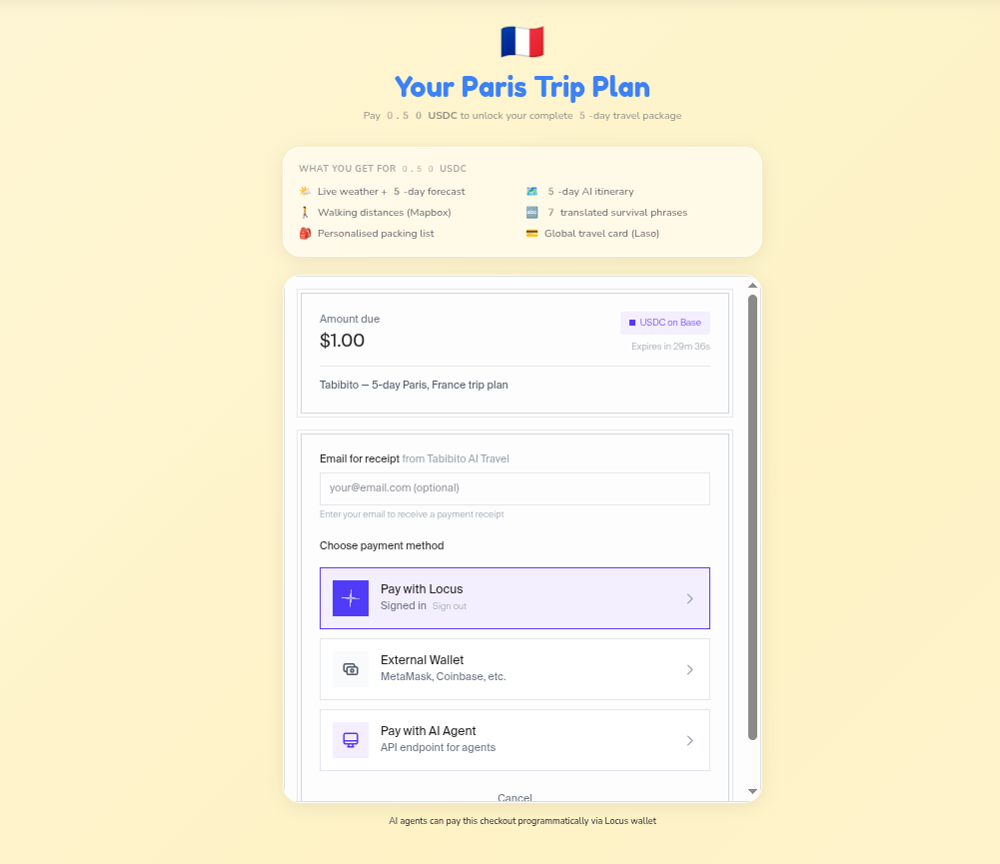
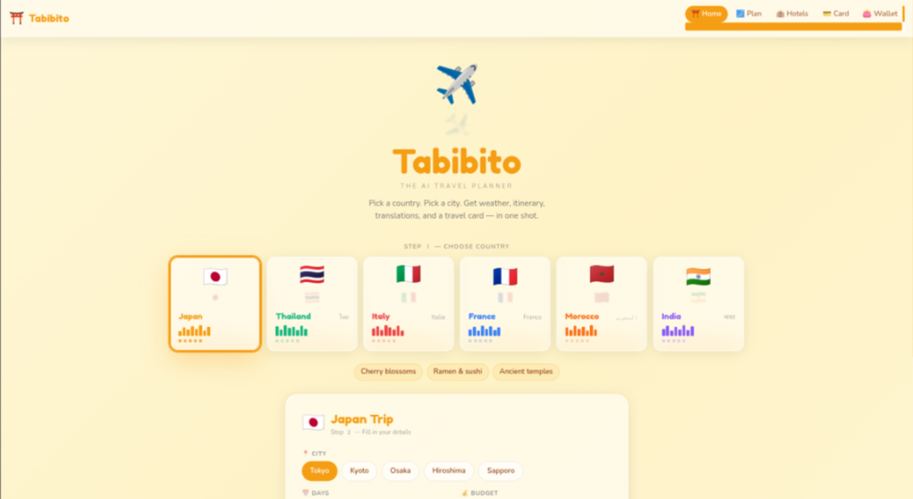

# Tabibito 旅人 — AI Travel Planner

> One message. Complete trip prep — weather, itinerary, translations, and a global travel card.

**Live:** https://svc-molr3ae0khconwzx.beta.buildwithlocus.com

Built for the [Paygentic Hackathon Week 3](https://paygentic-week3.devfolio.co) — Checkout with Locus track.

---

## What it does

Type your destination. Pay 0.50 USDC via Locus Checkout. Get:

- 🌤️ **Live weather** + 5-day forecast (OpenWeather)
- 🗺️ **AI itinerary** with real locations (Gemini)
- 🚶 **Walking distances** between stops (Mapbox)
- 🔤 **Translated phrases** in the local language (DeepL)
- 🎒 **Packing list** based on weather
- 💳 **Global travel card** — virtual Visa loaded with USDC (Laso Finance)
- 🏨 **Hotel search** via AI browser agent (Browser Use)

## Countries supported

🇯🇵 Japan · 🇹🇭 Thailand · 🇮🇹 Italy · 🇫🇷 France · 🇲🇦 Morocco · 🇮🇳 India

## Tech stack

| Layer | Tech |
|---|---|
| Frontend | React + Vite + Tailwind + Framer Motion |
| Backend | Express.js |
| Payments | Locus Checkout (`@withlocus/checkout-react`) |
| Travel card | Laso Finance (x402 / USDC) |
| AI | Gemini 2.0 Flash (via Locus wrapped API) |
| Weather | OpenWeather (via Locus wrapped API) |
| Maps | Mapbox (via Locus wrapped API) |
| Translation | DeepL (via Locus wrapped API) |
| Browser automation | Browser Use (via Locus wrapped API) |
| Deployment | Build with Locus |

## Screenshots




## Run locally

```bash
# Terminal 1 — backend
cd server && node index.js

# Terminal 2 — frontend
npm run dev
```

Open http://localhost:5173

## How the checkout works

1. User fills trip form → clicks submit
2. Server creates a Locus Checkout session ($0.50 USDC)
3. `LocusCheckout` component renders the payment UI
4. On payment confirmed → trip plan generates automatically
5. AI agents can pay the same checkout programmatically

## Architecture

```
User → React frontend → /checkout (Locus Checkout)
                      → /dashboard (plan-trip orchestrator)
                           ├── OpenWeather (weather)
                           ├── Gemini (itinerary)
                           │     └── Mapbox (walking distances)
                           └── DeepL (translations)

/card → Laso Finance (virtual Visa card via USDC)
/accommodation → Browser Use (hotel search)
```
